<div align="center">

# الشغيلي · Al-Shughaily

**Arabic-first AI Job Copilot — مساعدك الذكي للتوظيف**

[](https://react.dev)
[](https://www.typescriptlang.org)
[](https://expressjs.com)
[](https://flask.palletsprojects.com)
[](https://www.postgresql.org)
[](https://redis.io)
[](https://docs.docker.com/compose)

A full-stack SaaS that helps Arabic-speaking job seekers upload CVs, get AI-matched job recommendations, receive cover letter generation, ATS scoring, interview prep, and an intelligent copilot — all in a fully bilingual (Arabic RTL / English LTR) interface.

</div>

---

## About

Al-Shughaily is a personal full-stack project built to explore what an end-to-end AI product looks like when every layer — parsing, embeddings, LLM orchestration, background job scheduling, and a genuinely bilingual UI — has to work together in production, not just in a notebook. It's the project I point to when talking about system design across a browser, an API, a task queue, and an AI service that all have to agree with each other.

## Demo / Screenshots

<table>
  <tr>
    <td align="center" width="50%">
      <b>Login — تسجيل الدخول</b><br/>
      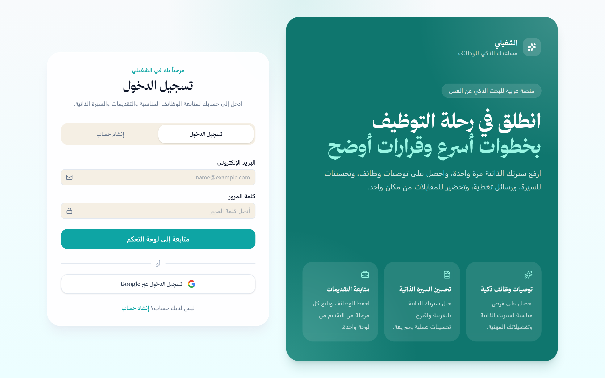
    </td>
    <td align="center" width="50%">
      <b>Validation error state</b><br/>
      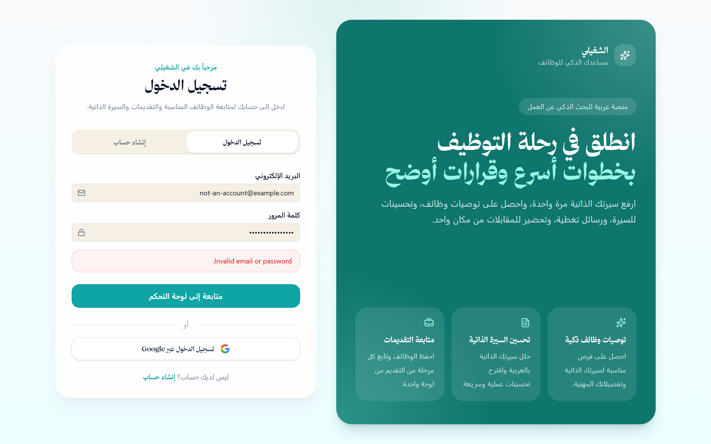
    </td>
  </tr>
  <tr>
    <td align="center" width="50%">
      <b>Dashboard — لوحة التحكم</b><br/>
      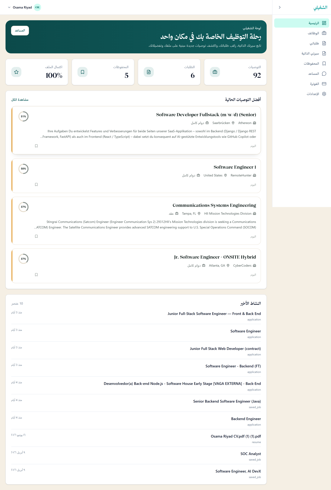
    </td>
    <td align="center" width="50%">
      <b>Job Search & Agents — الوظائف</b><br/>
      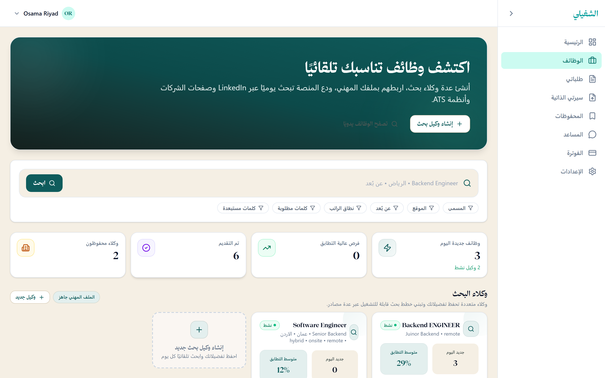
    </td>
  </tr>
  <tr>
    <td align="center" width="50%">
      <b>Job Detail — AI match + ATS review</b><br/>
      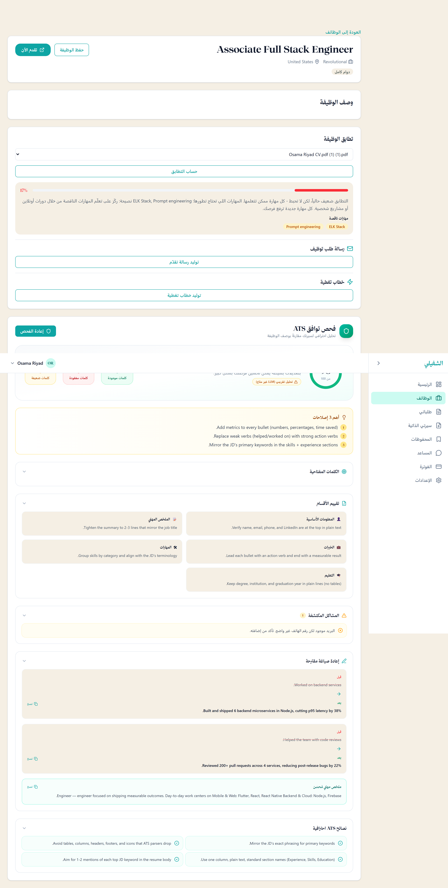
    </td>
    <td align="center" width="50%">
      <b>Resume Manager — سيرتي الذاتية</b><br/>
      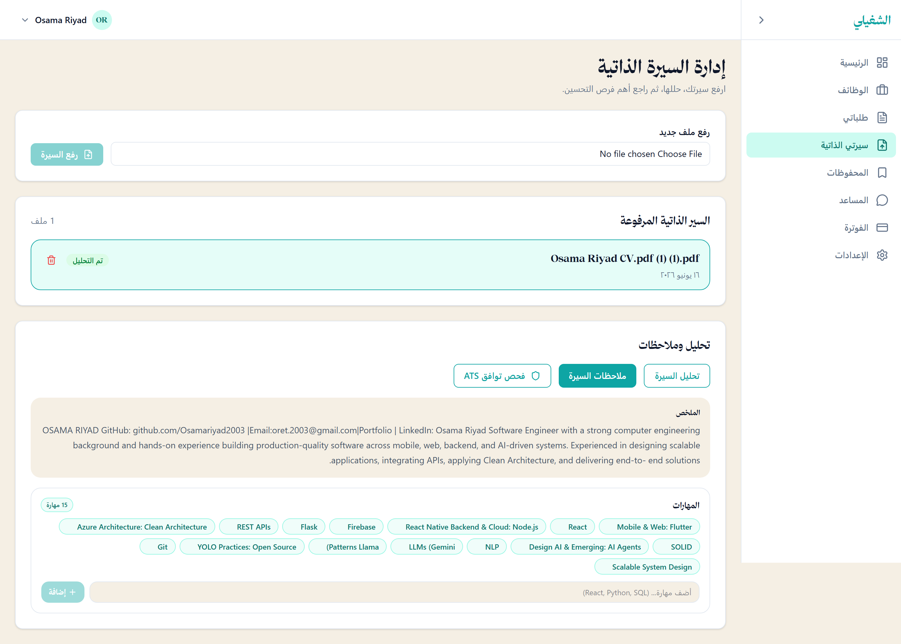
    </td>
  </tr>
  <tr>
    <td align="center" width="50%">
      <b>Application Tracker — متابعة الطلبات</b><br/>
      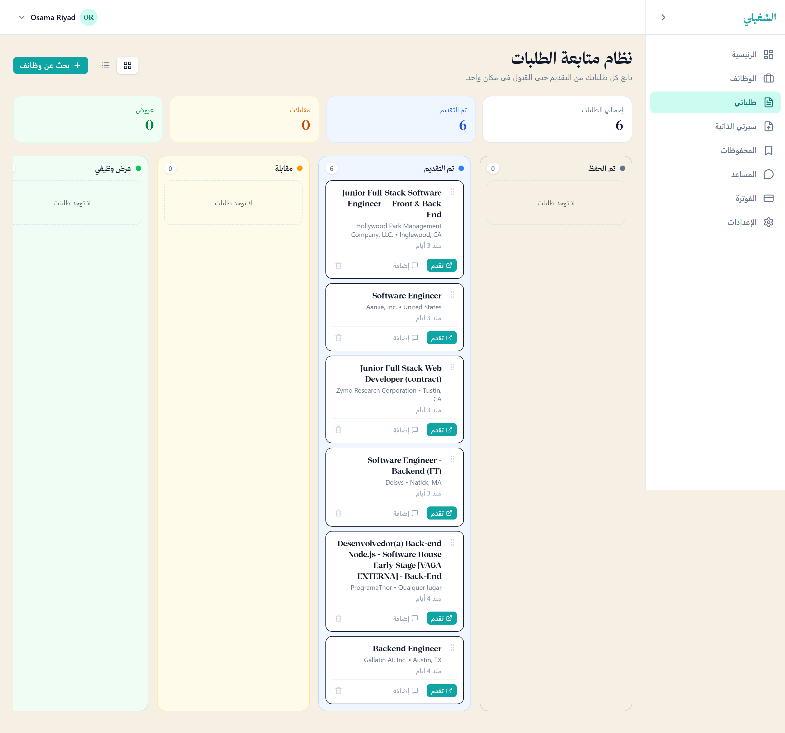
    </td>
    <td align="center" width="50%">
      <b>Saved Jobs — المحفوظات</b><br/>
      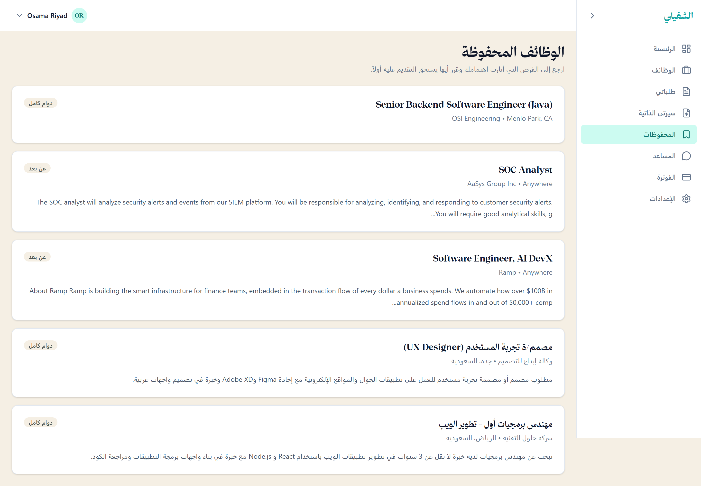
    </td>
  </tr>
  <tr>
    <td align="center" width="50%">
      <b>Copilot Chat — المساعد</b><br/>
      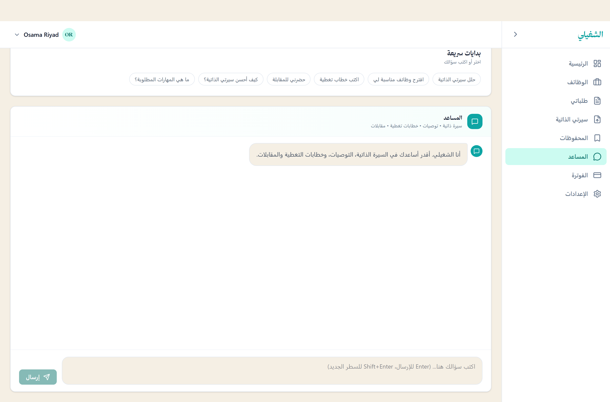
    </td>
    <td align="center" width="50%">
      <b>Billing & Usage — الفوترة</b><br/>
      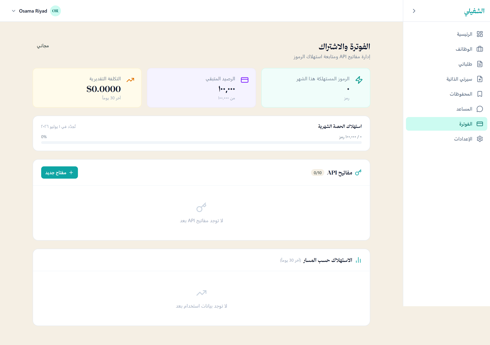
    </td>
  </tr>
  <tr>
    <td align="center" width="50%">
      <b>Settings — language toggle</b><br/>
      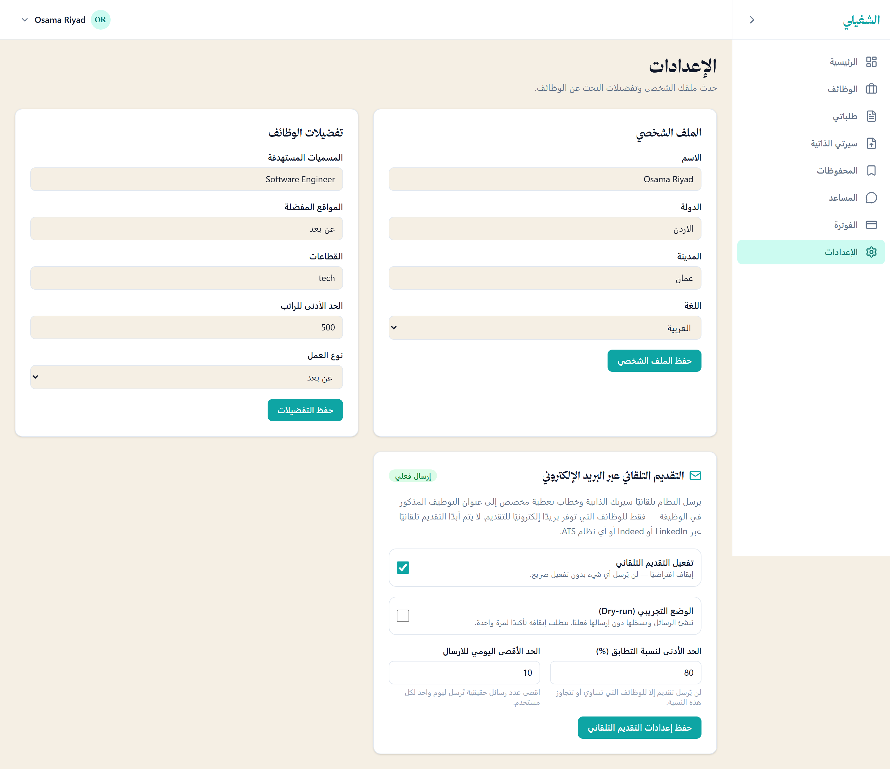
    </td>
    <td align="center"></td>
  </tr>
</table>


---

## Table of Contents

- [About](#about)
- [Demo / Screenshots](#demo--screenshots)
- [Features](#features)
- [Architecture](#architecture)
- [Project Structure](#project-structure)
- [Quick Start](#quick-start)
  - [Docker (recommended)](#docker-recommended)
  - [Local Dev (no Docker)](#local-dev-no-docker)
- [Environment Variables](#environment-variables)
- [AI Agents](#ai-agents)
- [API Reference](#api-reference)
- [Tech Stack](#tech-stack)
- [Brand](#brand)

---

## Features

| Feature | Description |
|---|---|
| **CV Upload & Parsing** | PDF / DOCX → structured JSON via LLM + regex pipeline |
| **Semantic Job Matching** | pgvector embeddings + skill overlap scoring |
| **AI Recommendations** | Ranked job feed with Arabic explanations |
| **ATS Checker** | Rule-based score + OpenRouter LLM improvement tips |
| **CV Improvement** | Detect weaknesses, rewrite bullet points |
| **Cover Letter Generator** | Tailored Arabic / English letters |
| **Interview Prep** | Role-specific questions + model answers |
| **Copilot Chat** | Conversational assistant with intent routing |
| **Application Tracker** | Kanban-style pipeline for all applications |
| **Search Agents** | Saved, recurring job searches that run automatically across sources |
| **Bilingual UI (AR/EN)** | Full Arabic (RTL) and English (LTR) interface, switchable live with no reload |
| **API Keys & Usage Billing** | Per-user API keys with token-usage tracking and quotas |

---

## Architecture

```
┌─────────────────────────────────────────────────────────┐
│                Browser (AR/RTL ↔ EN/LTR)                │
│              React 19 + Vite + Tailwind 4               │
└───────────────────────┬─────────────────────────────────┘
                        │ HTTP / REST
┌───────────────────────▼─────────────────────────────────┐
│                 Express API  :4000                      │
│          TypeScript · JWT Auth · BullMQ Jobs            │
└──────┬────────────────┬───────────────┬─────────────────┘
       │                │               │
  PostgreSQL        Redis :6379     Flask AI :5050
  + pgvector        (queue)        sentence-transformers
  (jobs, users,                    OpenRouter / Groq LLM
   resumes, apps)                  10 specialized pipelines
                                        │
                                   S3 / R2
                                  (CV files)
```

---

## Project Structure

```
shughaily/
├── frontend/                  # React + Vite + Tailwind
│   ├── src/
│   │   ├── components/        # Shared UI components
│   │   ├── pages/             # Route-level pages
│   │   ├── services/          # API client layer
│   │   ├── store/          # Zustand state (auth, i18n, UI)
│   │   └── lib/            # Types, utils, cn helper, i18n locales
│   ├── scripts/            # capture-screenshots.mjs (Playwright)
│   └── vite.config.ts
│
├── backend/                   # Express + TypeScript
│   └── src/
│       ├── controllers/       # Route handlers
│       ├── routes/            # Express routers
│       ├── services/          # Business logic & AI bridge
│       ├── jobs/              # BullMQ workers
│       ├── middlewares/       # Auth, rate limiting, error handling
│       └── config/            # Env + DB config
│
├── ai-service/                # Flask AI orchestrator
│   ├── pipelines/             # 10 AI pipelines
│   ├── routes/                # Flask blueprints
│   ├── services/              # LLM client, embeddings, DB
│   ├── utils/                 # Arabic text normalization
│   └── run.py
│
├── database/
│   ├── migrations/            # Incremental schema migrations
│   ├── schema.sql             # Full PostgreSQL schema
│   └── seed.sql               # Dev seed data
│
├── screenshots/                # Portfolio screenshots (see Demo section)
├── shared/                    # Shared Zod schemas / types
└── docker-compose.yml
```

---

## Quick Start

### Docker (recommended)

> Requires Docker Desktop with the Linux engine running.

```bash
# 1. Clone and enter
git clone https://github.com/your-org/shughaily.git
cd shughaily

# 2. Configure environment
cp .env.example .env
# Fill in: JWT_SECRET, GROQ_API_KEY, OPENROUTER_API_KEY, S3_* keys

# 3. Start all services
docker compose up -d

# 4. Check health
docker compose ps
```

| Service | URL |
|---|---|
| Frontend | http://localhost:3000 |
| Backend API | http://localhost:4000/api/v1 |
| AI Service | http://localhost:5050 |
| PostgreSQL | localhost:5432 |
| Redis | localhost:6379 |

---

### Local Dev (no Docker)

**Prerequisites:** Node 20+, Python 3.11+, PostgreSQL 16+, Redis 7+

#### 1. Database

```bash
# Create DB and apply schema
psql -U postgres -c "CREATE DATABASE shughaily;"
psql -U postgres -d shughaily -f database/schema.sql
psql -U postgres -d shughaily -f database/seed.sql
```

> On Windows, install pgvector from [pgvector releases](https://github.com/pgvector/pgvector/releases) or run `install-pgvector.bat`.

#### 2. Backend

```bash
cd backend
npm install
npm run dev        # tsx watch — restarts on file changes
# → http://localhost:4000
```

#### 3. AI Service

```bash
cd ai-service
python -m venv .venv
.venv\Scripts\activate        # Windows
# source .venv/bin/activate   # macOS / Linux
pip install -r requirements.txt
python run.py
# → http://localhost:5050
```

#### 4. Frontend

```bash
cd frontend
npm install
npm run dev
# → http://localhost:5173
```

---

## Environment Variables

Copy `.env.example` to `.env` and fill in the values below.

```env
# ── Database ──────────────────────────────────────────────
DATABASE_URL=postgresql://postgres@localhost:5432/shughaily
POSTGRES_USER=postgres
POSTGRES_PASSWORD=
POSTGRES_DB=shughaily

# ── Redis ─────────────────────────────────────────────────
REDIS_URL=redis://localhost:6379

# ── Express Backend ───────────────────────────────────────
PORT=4000
NODE_ENV=development
JWT_SECRET=change-me-32-chars-minimum
JWT_EXPIRES_IN=7d
CORS_ORIGIN=http://localhost:3000,http://localhost:5173
FLASK_AI_URL=http://localhost:5050

# Shared secret the backend sends on every call to the AI service — both
# services require this to be set (fail fast if missing) and it must be
# byte-identical in both .env files. Generate with `openssl rand -hex 32`.
INTERNAL_AUTH_TOKEN=change-me-generate-a-random-64-char-hex-secret

# ── Flask AI Service ──────────────────────────────────────
FLASK_PORT=5050
# Never "true" outside a machine nothing else can reach — the interactive
# Werkzeug debugger this enables is remote code execution.
FLASK_DEBUG=false
HF_MODEL_NAME=sentence-transformers/paraphrase-multilingual-MiniLM-L12-v2
EXPRESS_URL=http://localhost:4000

# ── LLM Providers (at least one required for AI features) ─
GROQ_API_KEY=                  # https://console.groq.com
GROQ_MODEL=llama-3.3-70b-versatile
OPENROUTER_API_KEY=            # https://openrouter.ai/keys
OPENROUTER_MODEL=openai/gpt-oss-120b:free

# ── Storage (S3 / Cloudflare R2) ──────────────────────────
S3_BUCKET=shughaily-uploads
S3_REGION=us-east-1
S3_ACCESS_KEY=
S3_SECRET_KEY=
S3_ENDPOINT=                   # leave blank for AWS; set for R2

# ── Frontend ──────────────────────────────────────────────
VITE_BACKEND_URL=http://localhost:4000
```

---

## AI Agents

The Flask service runs 10 specialized pipelines triggered by the Express backend:

| Pipeline | File | Description |
|---|---|---|
| Resume Parser | `pipelines/resume_parser.py` | PDF/DOCX → structured JSON with LLM normalization |
| Job Processor | `pipelines/job_processor.py` | Normalize & embed job descriptions |
| Matcher | `pipelines/matcher.py` | pgvector cosine similarity + skill overlap |
| Recommendation | `pipelines/recommendation.py` | Ranked feed with Arabic reasoning |
| CV Improver | `pipelines/cv_improver.py` | Weakness detection + rewrite suggestions |
| Cover Letter | `pipelines/cover_letter.py` | Tailored letters in Arabic or English |
| ATS Checker | `pipelines/ats_checker.py` | Rule-based score + LLM improvement tips |
| Job Targeting | `pipelines/job_targeting.py` | Preferences → structured search config |
| Auto Apply Decision | `pipelines/auto_apply_decision.py` | Fit scoring before applying |
| Apply Pack | `pipelines/apply_pack.py` | Bundle CV + cover letter for application |

**LLM routing:** OpenRouter is tried first; Groq is the fallback. Both use the OpenAI-compatible `/chat/completions` endpoint. If neither is available, pipelines degrade gracefully to rule-based output.

---

## API Reference

### Auth

| Method | Endpoint | Description |
|---|---|---|
| `POST` | `/api/v1/auth/register` | Register with email + password |
| `POST` | `/api/v1/auth/login` | Login, returns JWT |
| `GET` | `/api/v1/auth/google` | OAuth with Google |
| `GET` | `/api/v1/auth/me` | Current user profile |

### Jobs

| Method | Endpoint | Description |
|---|---|---|
| `GET` | `/api/v1/jobs` | Paginated job list with filters |
| `GET` | `/api/v1/jobs/:id` | Job detail |
| `GET` | `/api/v1/jobs/recommended` | AI-ranked recommendations |

### Resumes

| Method | Endpoint | Description |
|---|---|---|
| `POST` | `/api/v1/resumes/upload` | Upload PDF / DOCX |
| `POST` | `/api/v1/resumes/:id/parse` | Trigger AI parsing |
| `GET` | `/api/v1/resumes` | List user resumes |
| `DELETE` | `/api/v1/resumes/:id` | Delete resume |

### Copilot (AI Features)

| Method | Endpoint | Description |
|---|---|---|
| `POST` | `/api/v1/copilot/chat` | Conversational copilot |
| `POST` | `/api/v1/copilot/cv-feedback` | CV improvement suggestions |
| `POST` | `/api/v1/copilot/cover-letter` | Generate cover letter |
| `POST` | `/api/v1/copilot/interview-prep` | Interview questions |
| `POST` | `/api/v1/copilot/ats-check` | ATS compatibility score + LLM tips |

### Applications

| Method | Endpoint | Description |
|---|---|---|
| `GET` | `/api/v1/applications` | Application tracker |
| `POST` | `/api/v1/applications` | Create application |
| `PATCH` | `/api/v1/applications/:id` | Update status |
| `DELETE` | `/api/v1/applications/:id` | Remove application |

### Dashboard

| Method | Endpoint | Description |
|---|---|---|
| `GET` | `/api/v1/dashboard/stats` | Counts, match rates, activity |

---

## Tech Stack

| Layer | Technology |
|---|---|
| **Frontend** | React 19, Vite 8, Tailwind 4, shadcn/ui, Framer Motion, TanStack Query, Zustand, React Router 7, Zod |
| **Backend** | Express 5, TypeScript 5.9, BullMQ, JWT, Multer, Helmet, Morgan |
| **AI Service** | Flask 3.1, sentence-transformers, pdfplumber, python-docx, psycopg2 |
| **LLM** | OpenRouter (primary) → Groq (fallback), OpenAI-compatible API |
| **Database** | PostgreSQL 16 + pgvector |
| **Queue** | Redis 7 + BullMQ |
| **Storage** | AWS S3 / Cloudflare R2 |
| **Auth** | JWT + Google OAuth 2.0 |
| **Security** | Internal service-to-service auth, rate limiting, SSRF-guarded file downloads, network-isolated AI service |
| **Testing / Tooling** | Playwright (E2E + screenshot automation) |
| **Containers** | Docker Compose |

---

## Brand

| Token | Value |
|---|---|
| **Primary** | `#0EA5A4` (teal) |
| **Gradient** | `#0EA5A4 → #06B6D4` |
| **Font (Arabic)** | IBM Plex Sans Arabic / Noto Sans Arabic |
| **Direction** | RTL (Arabic) / LTR (English) — switchable live via Settings |
| **Tone** | Practical, honest, supportive — never flatters, never fabricates |

---

<div align="center">

Built for Arabic-speaking job seekers · مبني لباحثي العمل الناطقين بالعربية

</div>
